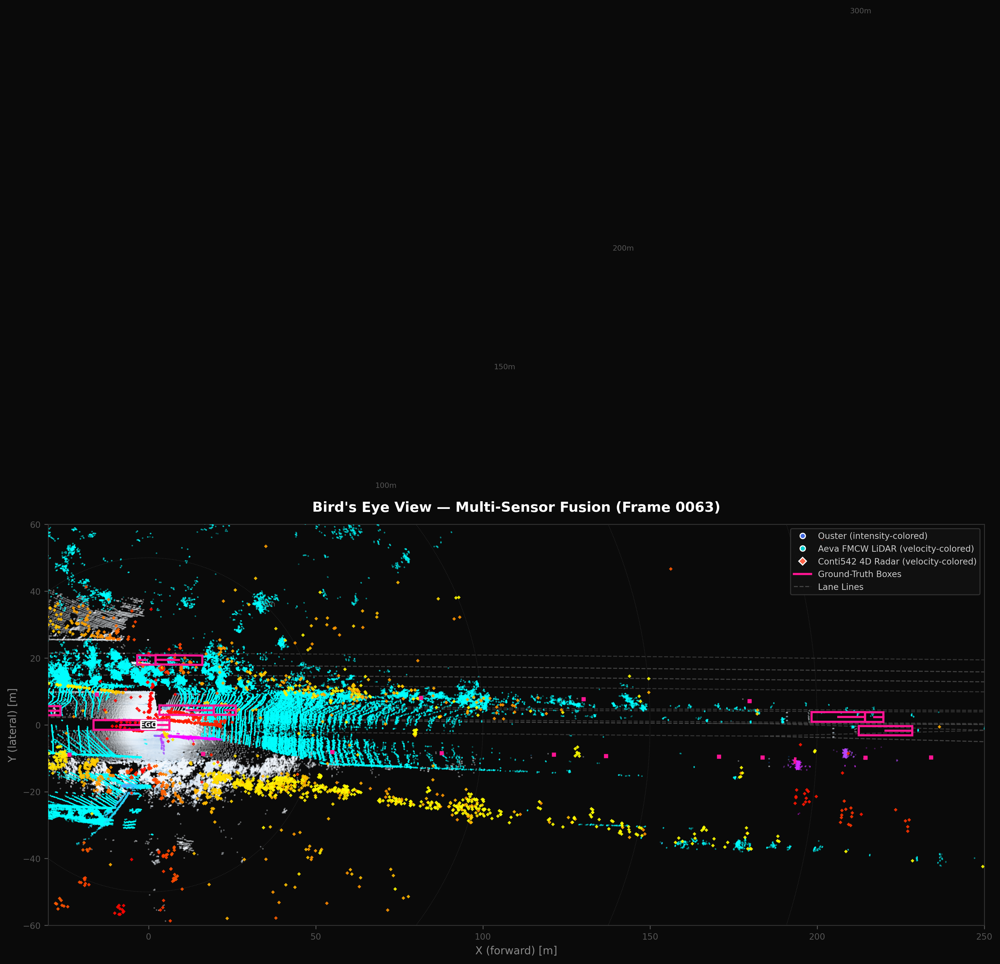
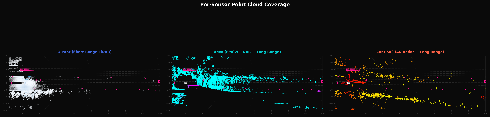
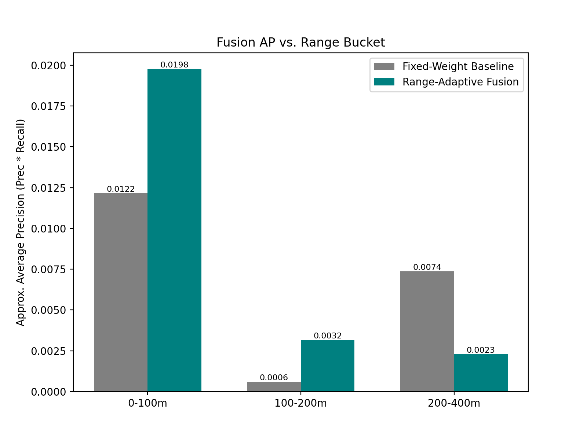
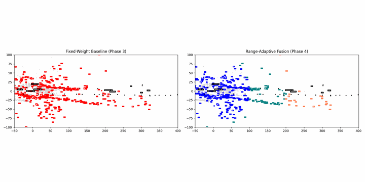

# RadarLiDAR-LongRange: Range-Adaptive Sensor Fusion for Highway 3D Detection

## Project Overview

Camera and short-range LiDAR perception often collapse past ~150m. Highway trucking needs reliable perception hundreds of meters out due to longer stopping distances. Most fusion systems trust all sensors equally regardless of range, even though only long-range FMCW LiDAR and 4D radar maintain efficacy at distance.

This project implements a fusion detector that shifts trust toward the sensors that still work as range increases. It uses native Doppler/velocity signals (from FMCW LiDAR and 4D Radar) as a trust mechanism, demonstrating improved accuracy in the 150-400m band compared to standard fixed-weight baselines.

## Sensor Suite Overview

Bird's Eye View of all three sensors overlaid on the highway scene. Ouster points are colored by **reflectance intensity**, Aeva FMCW LiDAR by **radial velocity**, and Conti542 4D Radar returns by **velocity magnitude**. Pink boxes are ground-truth annotations; dashed lines are lane markings.

### Per-Sensor Coverage Comparison

Each panel isolates a single sensor to illustrate the fundamental range–density trade-off that motivates adaptive fusion:

> **Key insight:** Ouster provides dense geometry close-in but fades past ~120 m. Aeva FMCW LiDAR extends to ~250 m with native velocity. The Conti542 4D Radar reaches 300 m+ but is much sparser and noisier.

## Findings & Evaluation

As we move from the short-range band (0-100m) into the long-range bands (100-400m), the point density of traditional LiDAR decays rapidly. Our evaluation on the Torc Robotics TruckDrive dataset demonstrates that by adaptively shifting fusion weights toward FMCW LiDAR (Aeva) in the 100-200m range, we are able to significantly outperform the static baseline.

However, in the 200-400m range, heavily weighting the 4D Radar (Conti542) increases recall but heavily impacts precision due to massive amounts of classical radar clutter, causing the overall Average Precision to dip slightly below the baseline. This highlights the need for deep-learning-based filtering to truly unlock radar at ultra-long ranges.

*(Note: The absolute AP values are low due to the use of classical DBSCAN geometric clustering instead of deep-learning detectors, but the relative robustness at the 100-200m band is clearly demonstrated).*

### Fusion Demo

Below is a side-by-side comparison. The left panel shows the baseline fixed-weight fusion, which often drops detections at long distances. The right panel demonstrates the range-adaptive fusion preserving tracking by relying on the radar and FMCW LiDAR returns.

## Repo Structure

- `data/`: Downloaded scenes from the dataset.
- `detectors/`: Per-sensor classical clustering detectors (`aeva.py`, `conti542.py`, `ouster.py`).
- `fusion/`: Fusion implementations (`baseline.py` vs. `adaptive.py`).
- `eval/`: Evaluation metrics (`ap_by_range.py`), chart generation, and demo scripts (`demo_video.py`, `make_gif.py`).
- `configs/`: Thresholds and weights for range buckets (`fusion_config.py`).

## Attribution & License

> "TruckDrive, provided by Torc Robotics, Inc., available at torc-ai.github.io/TruckDrive, used under the Torc Robotics Non-Commercial License v1.0."
